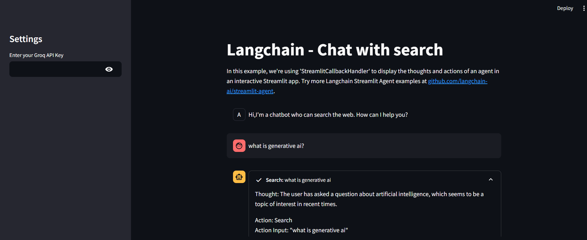

# 🚀 LangChain - Chat with Search



This project demonstrates a **chatbot** 🤖 that can search the web using **LangChain** and **Streamlit**. The chatbot retrieves information from **Wikipedia📚, Arxiv📄, and DuckDuckGo🌐** to provide accurate responses.

## ✨ Features

- **🖥️ Interactive Chatbot Interface**: Built using Streamlit for a seamless user experience.
- **🔍 Multi-Source Search**: Fetches data from Wikipedia, Arxiv, and DuckDuckGo.
- **⚡ Real-Time AI Agent Actions**: Displays the agent's thought process and decision-making steps.

## 📥 Installation

### 1️⃣ Clone the Repository
```sh
git clone <repository_url>
cd Search_Engine
```

### 2️⃣ Create and Activate a Virtual Environment
```sh
python -m venv venv
source venv/bin/activate  # On Windows use `venv\Scripts\activate`
```

### 3️⃣ Install Dependencies
```sh
pip install -r requirements.txt
```

### 4️⃣ Set Up Environment Variables
Create a `.env` file in the root directory and add your **Groq API key**:
```sh
echo "GROQ_API_KEY=your_groq_api_key" > .env
```

## 🚀 Usage

### 1️⃣ Start the Streamlit App
```sh
streamlit run app.py
```

### 2️⃣ Access the Web Interface 🌐
Open your browser and go to:
```
http://localhost:8501
```

### 3️⃣ Enter Your API Key 🔑
Provide your **Groq API key** in the sidebar to activate the chatbot.

### 4️⃣ Start Chatting 💬
Ask questions in natural language, and the bot will retrieve relevant information for you.

## 🔥 Example Queries

- **"What is machine learning?"** 🤖
- **"Tell me about the latest research in AI."** 🧠
- **"Find articles on quantum computing."** ⚛️

## 🤝 Contributing

We welcome contributions! 🎉 Feel free to open an **issue** or submit a **pull request** to enhance the project.

## 📜 License

This project is licensed under the **MIT License** ✅.

